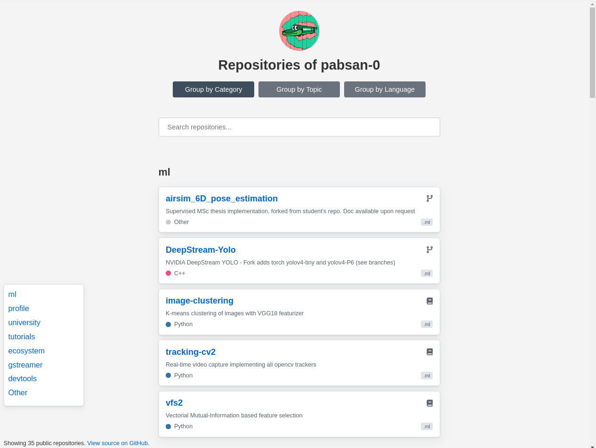

# Repos

This repo holds a static website that provides a custom frontend to my Github repositories.

Live at [pabsan-0.github.io/repos](https://pabsan-0.github.io/repos).

This page allows me to sort my repos as I like by parsing their `topics` for a keyword prefix, getting all data from a single call to Github's public API.

## Features 

### Groups 

Select/unselect the buttons to change grouping. Repository groupings are either by:

- Category: Custom groupings. Achieved by adding topics to my repos with the keyword `repos-` as a prefix.
- Topic: Plain GH topics, added by hand.
- Language: Automatic GH language recognition. 
- None: Display all repos in a flat category.

### URL parameters

- `groupby`: initial repository grouping, i.e. which grouping takes effect when loading the page at first, defaults to custom `Category`.
- `user`: the user for which to search repos, defaults to the github.io site owner.

## Forking

If you want this preview for yourself:

- Fork your repositories
- Enable github pages
- Adjust the favicon and profile image sources

## Alternatives

The initial sole motivation for this site was to have a repository overview in which I could arrange my repos as I like. 

If you search on the web for repo organisation one of the most interesting ways to do this in GH is to use organizations, but that means changing repo URLs and seems -a priori- quite annoying to set up and modify.

